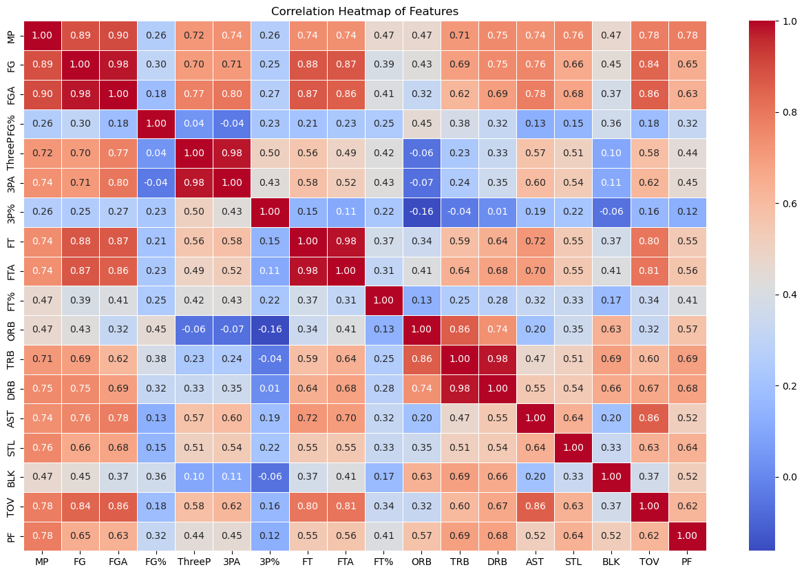
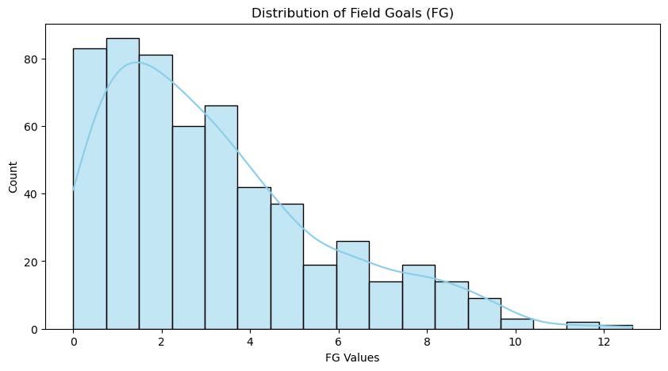
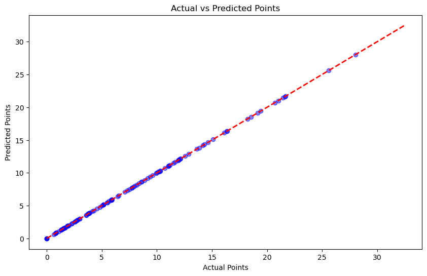

# 🏀 NBA Player Performance Prediction (2024-2025 Season)


This project leverages **Machine Learning** and **Statistical Analysis** to predict NBA player performance (Points Scored) based on the 2024-2025 season statistics. By analyzing metrics such as usage rates, shooting efficiency, and playtime, the model provides accurate scoring forecasts using Linear Regression algorithms.

---

## Project Overview & Goals

The primary objective is to build a predictive model that estimates a player's **Points (PTS)** output. The project follows a rigorous Data Science lifecycle:
1.  **Data Collection:** Gathering 2024-2025 active player stats.
2.  **Exploratory Data Analysis (EDA):** Understanding feature distributions and correlations.
3.  **Statistical Validation:** Testing for normality (Kurtosis/Skewness) to ensure model reliability.
4.  **Modeling:** Training Linear Regression and OLS models.

---

## Exploratory Data Analysis (EDA)

### 1. Correlation Analysis
To determine which factors most heavily influence scoring, I generated a correlation matrix of all features.
> **Insight:** The heatmap confirms that **Field Goals (FG)**, **Field Goal Attempts (FGA)**, and **Minutes Played (MP)** have the highest positive correlation with Points (PTS).



### 2. Statistical Distribution (Normality Check)
Before applying Linear Regression, I analyzed the distribution of key variables. The histogram below shows the distribution of **Field Goals (FG)**. The curve helps visualize the skewness and kurtosis, guiding the decision on feature scaling and normalization.



---

##Top Performers Analysis

As part of the analysis, the system identified and ranked the top performing players of the current season based on a composite score of their stats (Game Score, Points, Assists, Rebounds).

> **Observation:** Nikola Jokić, Shai Gilgeous-Alexander, and Giannis Antetokounmpo lead the league in efficiency and scoring impact.


---

## Model Performance & Results

### Actual vs. Predicted Scores
The Linear Regression model was tested on a 20% holdout dataset. The scatter plot below demonstrates the relationship between the **Actual Points** (X-axis) and the **Predicted Points** (Y-axis).

* **R² Score:** ~0.95 (High Accuracy)
* **Trend:** The points tightly follow the red diagonal line, indicating that the model generalizes well and makes highly accurate predictions with minimal error variance.



---

## Tech Stack

* **Language:** Python 
* **Data Manipulation:** Pandas, NumPy
* **Visualization:** Matplotlib, Seaborn
* **Machine Learning:** Scikit-Learn
* **Statistics:** SciPy, Statsmodels (OLS Regression)

---

## How to Run Locally

1.  **Clone the repository**
    ```bash
    git clone [https://github.com/yucezis/NBA-Score-Prediction.git](https://github.com/yucezis/NBA-Score-Prediction.git)
    cd NBA-Score-Prediction
    ```

2.  **Install dependencies**
    ```bash
    pip install -r requirements.txt
    ```

3.  **Run the Jupyter Notebook**
    ```bash
    jupyter notebook NBA_Score_Prediction.ipynb
    ```

---

## Developer

* **Name:** Zişan Yüce
* **Role:** Computer Engineering Student

---

⭐ **If you like this project, don't forget to give it a star!**
